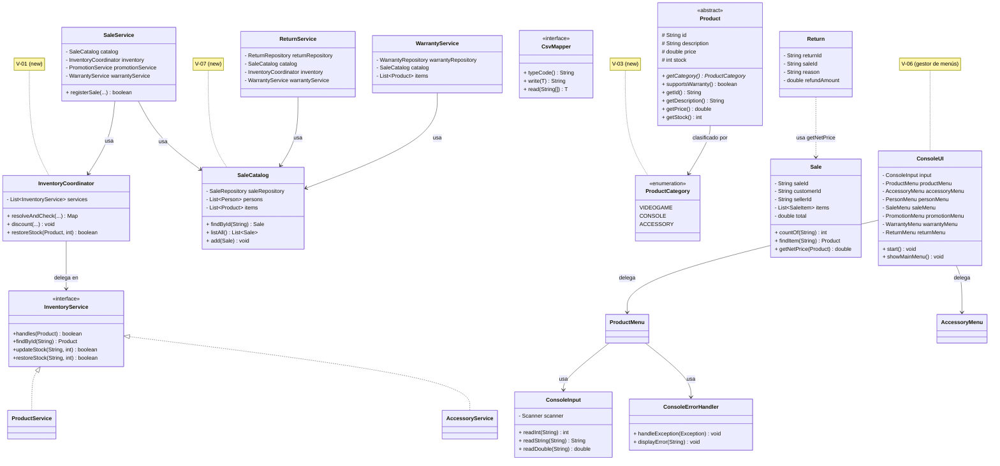

```mermaid
classDiagram
    class InventoryService {
        <<interface>>
        +handles(Product) boolean
        +findById(String) Product
        +updateStock(String, int) boolean
        +restoreStock(String, int) boolean
    }

    class InventoryCoordinator {
        - List~InventoryService~ services
        + resolveAndCheck(...) Map
        + discount(...) void
        + restoreStock(Product, int) boolean
    }

    class SaleCatalog {
        - SaleRepository saleRepository
        - List~Person~ persons
        - List~Product~ items
        + findById(String) Sale
        + listAll() List~Sale~
        + add(Sale) void
    }

    class SaleService {
        - SaleCatalog catalog
        - InventoryCoordinator inventory
        - PromotionService promotionService
        - WarrantyService warrantyService
        + registerSale(...) boolean
    }

    class ReturnService {
        - ReturnRepository returnRepository
        - SaleCatalog catalog
        - InventoryCoordinator inventory
        - WarrantyService warrantyService
    }

    class WarrantyService {
        - WarrantyRepository warrantyRepository
        - SaleCatalog catalog
        - List~Product~ items
    }

    class ProductCategory {
        <<enumeration>>
        VIDEOGAME
        CONSOLE
        ACCESSORY
    }

    class Product {
        <<abstract>>
        # String id
        # String description
        # double price
        # int stock
        + getCategory()* ProductCategory
        + supportsWarranty() boolean
        + getId() String
        + getDescription() String
        + getPrice() double
        + getStock() int
    }

    class Sale {
        - String saleId
        - String customerId
        - String sellerId
        - List~SaleItem~ items
        - double total
        + countOf(String) int
        + findItem(String) Product
        + getNetPrice(Product) double
    }

    class Return {
        - String returnId
        - String saleId
        - String reason
        - double refundAmount
    }

    class ConsoleUI {
        - ConsoleInput input
        - ProductMenu productMenu
        - AccessoryMenu accessoryMenu
        - PersonMenu personMenu
        - SaleMenu saleMenu
        - PromotionMenu promotionMenu
        - WarrantyMenu warrantyMenu
        - ReturnMenu returnMenu
        + start() void
        + showMainMenu() void
    }

    class ConsoleInput {
        - Scanner scanner
        + readInt(String) int
        + readString(String) String
        + readDouble(String) double
    }

    class ConsoleErrorHandler {
        + handleException(Exception) void
        + displayError(String) void
    }

    class CsvMapper {
        <<interface>>
        + typeCode() String
        + write(T) String
        + read(String[]) T
    }

    InventoryService <|.. ProductService
    InventoryService <|.. AccessoryService
    InventoryCoordinator --> InventoryService : delega en
    SaleService --> InventoryCoordinator : usa
    SaleService --> SaleCatalog : usa
    ReturnService --> SaleCatalog : usa
    WarrantyService --> SaleCatalog : usa
    Product --> ProductCategory : clasificado por
    Return ..> Sale : usa getNetPrice
    ConsoleUI --> ProductMenu : delega
    ConsoleUI --> AccessoryMenu : delega
    ProductMenu --> ConsoleInput : usa
    ProductMenu --> ConsoleErrorHandler : usa

    note for InventoryCoordinator "V-01 (new)"
    note for SaleCatalog "V-07 (new)"
    note for ProductCategory "V-03 (new)"
    note for ConsoleUI "V-06 (gestor de menús)"
```