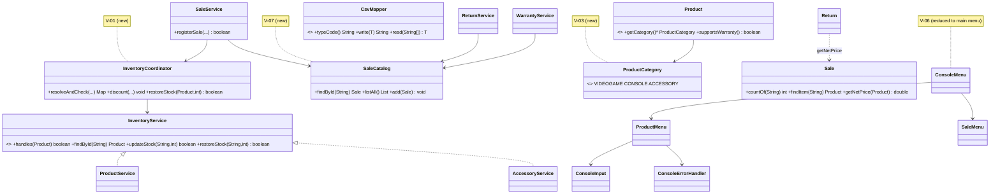

```mermaid
classDiagram
    class InventoryService { <<interface>> +handles(Product) boolean +findById(String) Product +updateStock(String,int) boolean +restoreStock(String,int) boolean }
    class InventoryCoordinator { +resolveAndCheck(...) Map +discount(...) void +restoreStock(Product,int) boolean }
    class SaleCatalog { +findById(String) Sale +listAll() List +add(Sale) void }
    class SaleService { +registerSale(...) boolean }
    class ProductCategory { <<enumeration>> VIDEOGAME CONSOLE ACCESSORY }
    class Product { <<abstract>> +getCategory()* ProductCategory +supportsWarranty() boolean }
    class Sale { +countOf(String) int +findItem(String) Product +getNetPrice(Product) double }
    class Return
    class ConsoleMenu
    class ConsoleInput
    class ConsoleErrorHandler
    class CsvMapper { <<interface>> +typeCode() String +write(T) String +read(String[]) T }
    InventoryService <|.. ProductService
    InventoryService <|.. AccessoryService
    InventoryCoordinator --> InventoryService
    SaleService --> InventoryCoordinator
    SaleService --> SaleCatalog
    ReturnService --> SaleCatalog
    WarrantyService --> SaleCatalog
    Product --> ProductCategory
    Return ..> Sale : getNetPrice
    ConsoleMenu --> ProductMenu
    ConsoleMenu --> SaleMenu
    ProductMenu --> ConsoleInput
    ProductMenu --> ConsoleErrorHandler
    note for InventoryCoordinator "V-01 (new)"
    note for SaleCatalog "V-07 (new)"
    note for ProductCategory "V-03 (new)"
    note for ConsoleMenu "V-06 (reduced to main menu)"
```