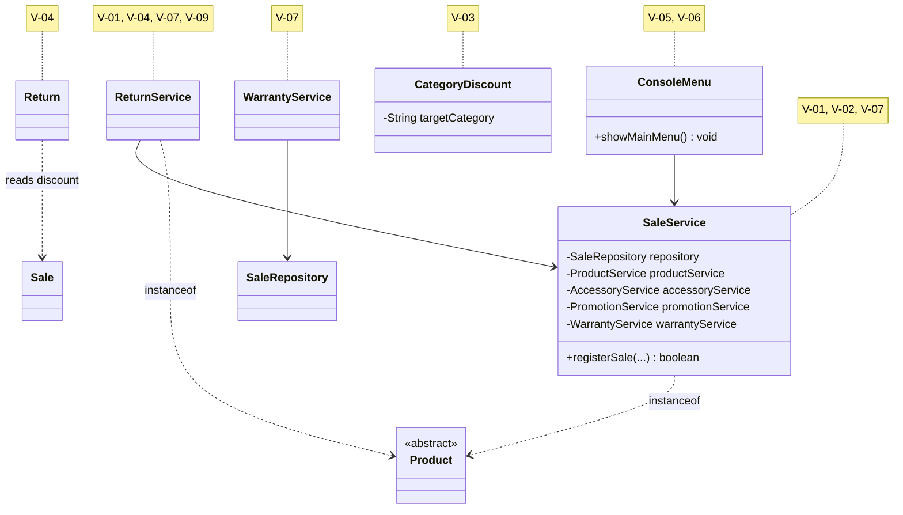

```mermaid
classDiagram
    class SaleService {
        -SaleRepository repository
        -ProductService productService
        -AccessoryService accessoryService
        -PromotionService promotionService
        -WarrantyService warrantyService
        +registerSale(...) boolean
    }
    class WarrantyService
    class ReturnService
    class ConsoleMenu { +showMainMenu() void }
    class CategoryDiscount { -String targetCategory }
    class Product { <<abstract>> }
    class Return
    class Sale
    SaleService ..> Product : instanceof
    ReturnService ..> Product : instanceof
    ReturnService --> SaleService
    WarrantyService --> SaleRepository
    ConsoleMenu --> SaleService
    Return ..> Sale : reads discount
    note for SaleService "V-01, V-02, V-07"
    note for ReturnService "V-01, V-04, V-07, V-09"
    note for WarrantyService "V-07"
    note for ConsoleMenu "V-05, V-06"
    note for CategoryDiscount "V-03"
    note for Return "V-04"
```
