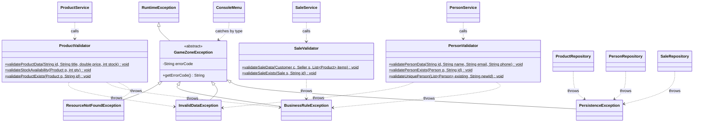

```mermaid
classDiagram
    class RuntimeException
    class GameZoneException {
        <<abstract>>
        -String errorCode
        +getErrorCode() String
    }
    class ResourceNotFoundException
    class BusinessRuleException
    class InvalidDataException
    class PersistenceException
    class ProductValidator {
        +validateProductData(String id, String title, double price, int stock)$ void
        +validateStockAvailability(Product p, int qty)$ void
        +validateProductExists(Product p, String id)$ void
    }
    class PersonValidator {
        +validatePersonData(String id, String name, String email, String phone)$ void
        +validatePersonExists(Person p, String id)$ void
        +validateUniquePerson(List~Person~ existing, String newId)$ void
    }
    class SaleValidator {
        +validateSaleData(Customer c, Seller s, List~Product~ items)$ void
        +validateSaleExists(Sale s, String id)$ void
    }
    class ProductService
    class PersonService
    class SaleService
    class ProductRepository
    class PersonRepository
    class SaleRepository
    class ConsoleMenu

    RuntimeException <|-- GameZoneException
    GameZoneException <|-- ResourceNotFoundException
    GameZoneException <|-- BusinessRuleException
    GameZoneException <|-- InvalidDataException
    GameZoneException <|-- PersistenceException

    ProductService ..> ProductValidator : calls
    PersonService ..> PersonValidator : calls
    SaleService ..> SaleValidator : calls
    ProductValidator ..> InvalidDataException : throws
    ProductValidator ..> BusinessRuleException : throws
    ProductValidator ..> ResourceNotFoundException : throws
    PersonValidator ..> InvalidDataException : throws
    PersonValidator ..> BusinessRuleException : throws
    SaleValidator ..> BusinessRuleException : throws
    ProductRepository ..> PersistenceException : throws
    PersonRepository ..> PersistenceException : throws
    SaleRepository ..> PersistenceException : throws
    ConsoleMenu ..> GameZoneException : catches by type
```