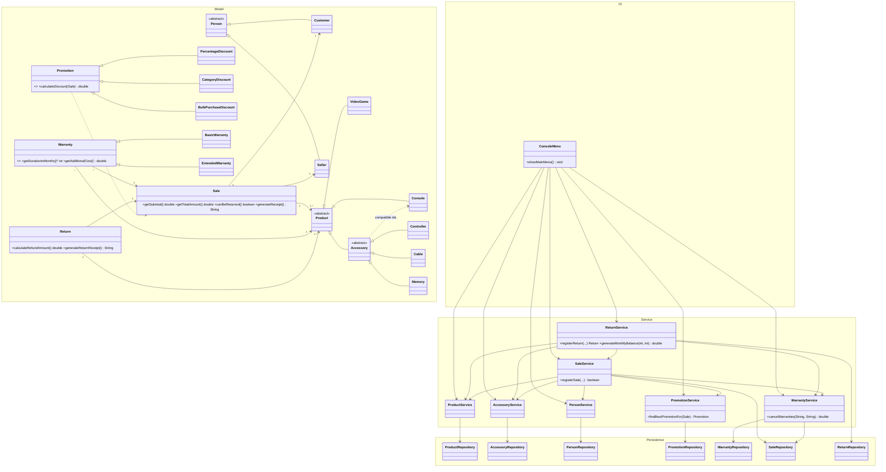

```mermaid
classDiagram
    namespace Model {
        class Person { <<abstract>> }
        class Customer
        class Seller
        class Product { <<abstract>> }
        class VideoGame
        class Console
        class Accessory { <<abstract>> }
        class Controller
        class Cable
        class Memory
        class Promotion { <<abstract>> +calculateDiscount(Sale)* double }
        class PercentageDiscount
        class CategoryDiscount
        class BulkPurchaseDiscount
        class Warranty { <<abstract>> +getDurationInMonths()* int +getAdditionalCost()* double }
        class BasicWarranty
        class ExtendedWarranty
        class Sale { +getSubtotal() double +getTotalAmount() double +canBeReturned() boolean +generateReceipt() String }
        class Return { +calculateRefundAmount() double +generateReturnReceipt() String }
    }
    namespace Persistence {
        class ProductRepository
        class AccessoryRepository
        class PersonRepository
        class PromotionRepository
        class WarrantyRepository
        class SaleRepository
        class ReturnRepository
    }
    namespace Service {
        class ProductService
        class AccessoryService
        class PersonService
        class PromotionService { +findBestPromotionFor(Sale) Promotion }
        class WarrantyService { +cancelWarranties(String, String) double }
        class SaleService { +registerSale(...) boolean }
        class ReturnService { +registerReturn(...) Return +generateMonthlyBalance(int, int) double }
    }
    namespace UI {
        class ConsoleMenu { +showMainMenu() void }
    }

    Person <|-- Customer
    Person <|-- Seller
    Product <|-- VideoGame
    Product <|-- Console
    Product <|-- Accessory
    Accessory <|-- Controller
    Accessory <|-- Cable
    Accessory <|-- Memory
    Promotion <|-- PercentageDiscount
    Promotion <|-- CategoryDiscount
    Promotion <|-- BulkPurchaseDiscount
    Warranty <|-- BasicWarranty
    Warranty <|-- ExtendedWarranty

    Sale "1" --> "1" Customer
    Sale "1" --> "1" Seller
    Sale "1" --> "1..*" Product
    Warranty "*" --> "1" Product
    Warranty "*" --> "1" Sale
    Return "*" --> "1" Sale
    Return "1" --> "1..*" Product
    Promotion ..> Sale
    Accessory ..> Console : compatible ids

    ProductService --> ProductRepository
    AccessoryService --> AccessoryRepository
    PersonService --> PersonRepository
    PromotionService --> PromotionRepository
    WarrantyService --> WarrantyRepository
    WarrantyService --> SaleRepository
    SaleService --> SaleRepository
    ReturnService --> ReturnRepository
    SaleService --> ProductService
    SaleService --> AccessoryService
    SaleService --> PersonService
    SaleService --> PromotionService
    SaleService --> WarrantyService
    ReturnService --> SaleService
    ReturnService --> ProductService
    ReturnService --> AccessoryService
    ReturnService --> WarrantyService
    ConsoleMenu --> ProductService
    ConsoleMenu --> AccessoryService
    ConsoleMenu --> PersonService
    ConsoleMenu --> PromotionService
    ConsoleMenu --> WarrantyService
    ConsoleMenu --> SaleService
    ConsoleMenu --> ReturnService
```