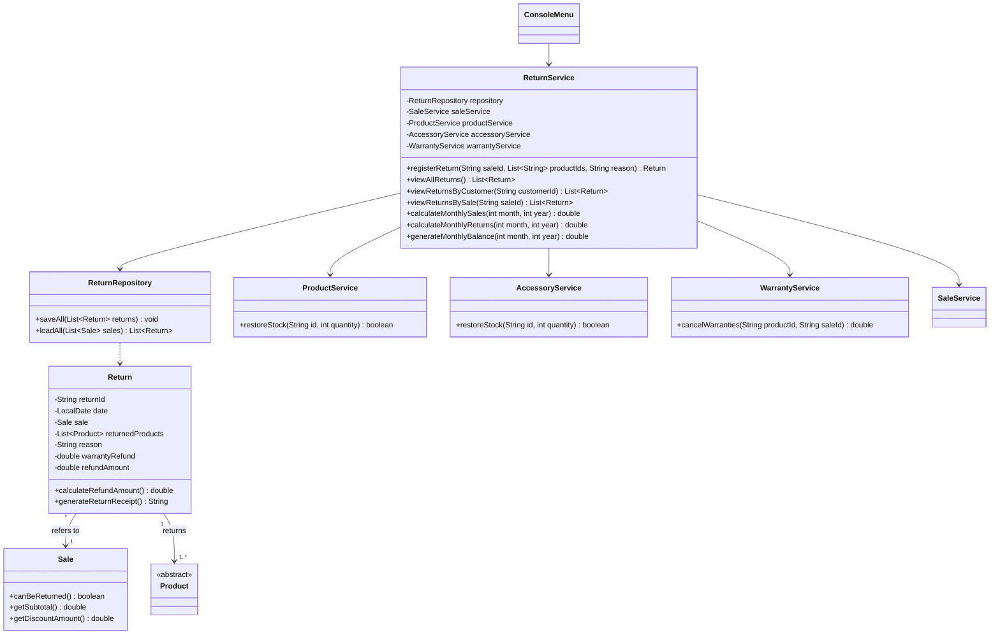

```mermaid
classDiagram
    class Return {
        -String returnId
        -LocalDate date
        -Sale sale
        -List~Product~ returnedProducts
        -String reason
        -double warrantyRefund
        -double refundAmount
        +calculateRefundAmount() double
        +generateReturnReceipt() String
    }
    class Sale {
        +canBeReturned() boolean
        +getSubtotal() double
        +getDiscountAmount() double
    }
    class ReturnRepository {
        +saveAll(List~Return~ returns) void
        +loadAll(List~Sale~ sales) List~Return~
    }
    class ReturnService {
        -ReturnRepository repository
        -SaleService saleService
        -ProductService productService
        -AccessoryService accessoryService
        -WarrantyService warrantyService
        +registerReturn(String saleId, List~String~ productIds, String reason) Return
        +viewAllReturns() List~Return~
        +viewReturnsByCustomer(String customerId) List~Return~
        +viewReturnsBySale(String saleId) List~Return~
        +calculateMonthlySales(int month, int year) double
        +calculateMonthlyReturns(int month, int year) double
        +generateMonthlyBalance(int month, int year) double
    }
    class ProductService { +restoreStock(String id, int quantity) boolean }
    class AccessoryService { +restoreStock(String id, int quantity) boolean }
    class WarrantyService { +cancelWarranties(String productId, String saleId) double }
    class SaleService
    class Product { <<abstract>> }
    class ConsoleMenu

    Return "*" --> "1" Sale : refers to
    Return "1" --> "1..*" Product : returns
    ReturnRepository ..> Return
    ReturnService --> ReturnRepository
    ReturnService --> SaleService
    ReturnService --> ProductService
    ReturnService --> AccessoryService
    ReturnService --> WarrantyService
    ConsoleMenu --> ReturnService
```