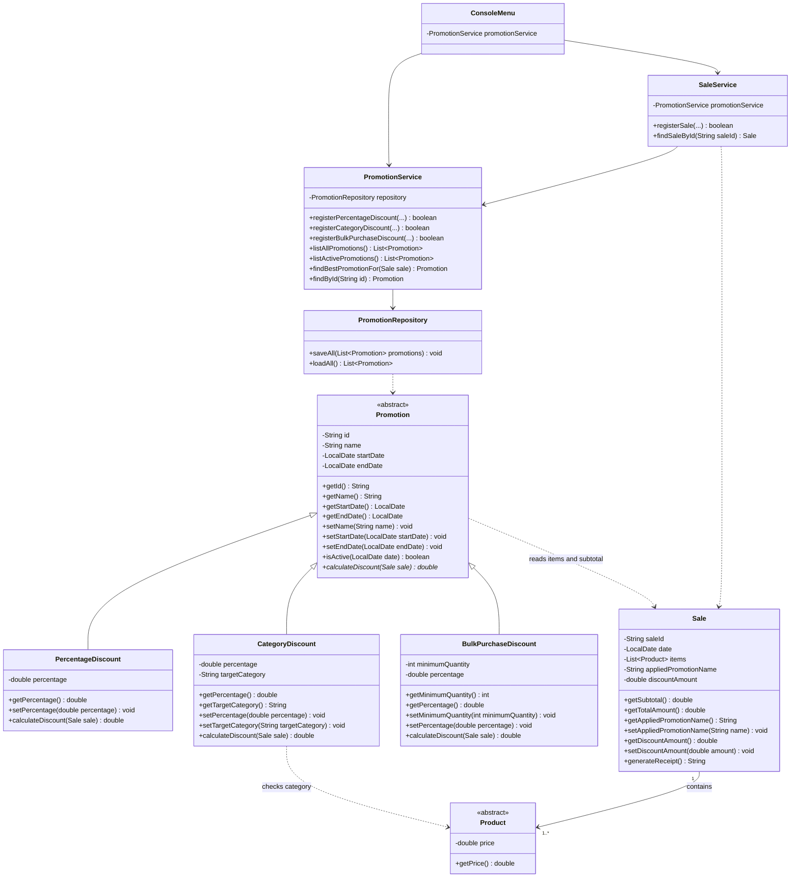

```mermaid
classDiagram
    class Promotion {
        <<abstract>>
        -String id
        -String name
        -LocalDate startDate
        -LocalDate endDate
        +getId() String
        +getName() String
        +getStartDate() LocalDate
        +getEndDate() LocalDate
        +setName(String name) void
        +setStartDate(LocalDate startDate) void
        +setEndDate(LocalDate endDate) void
        +isActive(LocalDate date) boolean
        +calculateDiscount(Sale sale)* double
    }
    class PercentageDiscount {
        -double percentage
        +getPercentage() double
        +setPercentage(double percentage) void
        +calculateDiscount(Sale sale) double
    }
    class CategoryDiscount {
        -double percentage
        -String targetCategory
        +getPercentage() double
        +getTargetCategory() String
        +setPercentage(double percentage) void
        +setTargetCategory(String targetCategory) void
        +calculateDiscount(Sale sale) double
    }
    class BulkPurchaseDiscount {
        -int minimumQuantity
        -double percentage
        +getMinimumQuantity() int
        +getPercentage() double
        +setMinimumQuantity(int minimumQuantity) void
        +setPercentage(double percentage) void
        +calculateDiscount(Sale sale) double
    }
    class Sale {
        -String saleId
        -LocalDate date
        -List~Product~ items
        -String appliedPromotionName
        -double discountAmount
        +getSubtotal() double
        +getTotalAmount() double
        +getAppliedPromotionName() String
        +setAppliedPromotionName(String name) void
        +getDiscountAmount() double
        +setDiscountAmount(double amount) void
        +generateReceipt() String
    }
    class Product {
        <<abstract>>
        -double price
        +getPrice() double
    }
    class PromotionRepository {
        +saveAll(List~Promotion~ promotions) void
        +loadAll() List~Promotion~
    }
    class PromotionService {
        -PromotionRepository repository
        +registerPercentageDiscount(...) boolean
        +registerCategoryDiscount(...) boolean
        +registerBulkPurchaseDiscount(...) boolean
        +listAllPromotions() List~Promotion~
        +listActivePromotions() List~Promotion~
        +findBestPromotionFor(Sale sale) Promotion
        +findById(String id) Promotion
    }
    class SaleService {
        -PromotionService promotionService
        +registerSale(...) boolean
        +findSaleById(String saleId) Sale
    }
    class ConsoleMenu {
        -PromotionService promotionService
    }

    Promotion <|-- PercentageDiscount
    Promotion <|-- CategoryDiscount
    Promotion <|-- BulkPurchaseDiscount

    Promotion ..> Sale : reads items and subtotal
    CategoryDiscount ..> Product : checks category
    Sale "1" --> "1..*" Product : contains
    PromotionRepository ..> Promotion
    PromotionService --> PromotionRepository
    SaleService --> PromotionService
    SaleService ..> Sale
    ConsoleMenu --> PromotionService
    ConsoleMenu --> SaleService
```