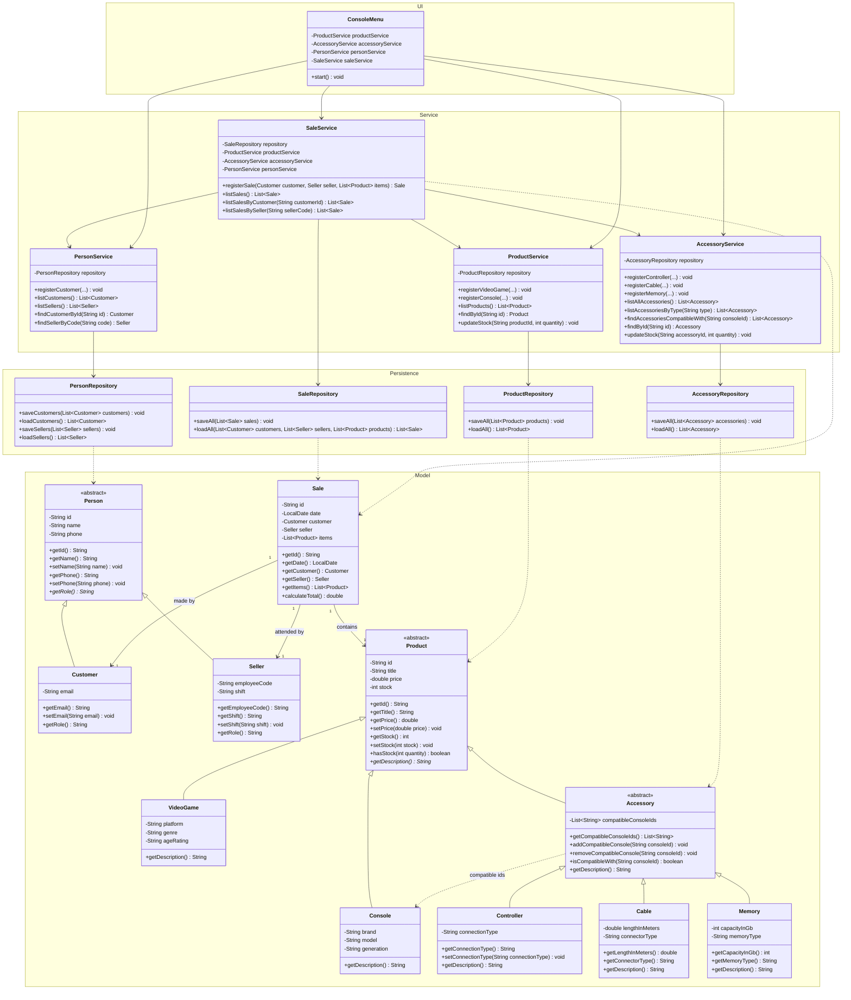

```mermaid
classDiagram
    namespace Model {
        class Person {
            <<abstract>>
            -String id
            -String name
            -String phone
            +getId() String
            +getName() String
            +setName(String name) void
            +getPhone() String
            +setPhone(String phone) void
            +getRole()* String
        }
        class Customer {
            -String email
            +getEmail() String
            +setEmail(String email) void
            +getRole() String
        }
        class Seller {
            -String employeeCode
            -String shift
            +getEmployeeCode() String
            +getShift() String
            +setShift(String shift) void
            +getRole() String
        }
        class Product {
            <<abstract>>
            -String id
            -String title
            -double price
            -int stock
            +getId() String
            +getTitle() String
            +getPrice() double
            +setPrice(double price) void
            +getStock() int
            +setStock(int stock) void
            +hasStock(int quantity) boolean
            +getDescription()* String
        }
        class VideoGame {
            -String platform
            -String genre
            -String ageRating
            +getDescription() String
        }
        class Console {
            -String brand
            -String model
            -String generation
            +getDescription() String
        }
        class Accessory {
            <<abstract>>
            -List~String~ compatibleConsoleIds
            +getCompatibleConsoleIds() List~String~
            +addCompatibleConsole(String consoleId) void
            +removeCompatibleConsole(String consoleId) void
            +isCompatibleWith(String consoleId) boolean
            +getDescription() String
        }
        class Controller {
            -String connectionType
            +getConnectionType() String
            +setConnectionType(String connectionType) void
            +getDescription() String
        }
        class Cable {
            -double lengthInMeters
            -String connectorType
            +getLengthInMeters() double
            +getConnectorType() String
            +getDescription() String
        }
        class Memory {
            -int capacityInGb
            -String memoryType
            +getCapacityInGb() int
            +getMemoryType() String
            +getDescription() String
        }
        class Sale {
            -String id
            -LocalDate date
            -Customer customer
            -Seller seller
            -List~Product~ items
            +getId() String
            +getDate() LocalDate
            +getCustomer() Customer
            +getSeller() Seller
            +getItems() List~Product~
            +calculateTotal() double
        }
    }

    namespace Persistence {
        class ProductRepository {
            +saveAll(List~Product~ products) void
            +loadAll() List~Product~
        }
        class AccessoryRepository {
            +saveAll(List~Accessory~ accessories) void
            +loadAll() List~Accessory~
        }
        class PersonRepository {
            +saveCustomers(List~Customer~ customers) void
            +loadCustomers() List~Customer~
            +saveSellers(List~Seller~ sellers) void
            +loadSellers() List~Seller~
        }
        class SaleRepository {
            +saveAll(List~Sale~ sales) void
            +loadAll(List~Customer~ customers, List~Seller~ sellers, List~Product~ products) List~Sale~
        }
    }

    namespace Service {
        class ProductService {
            -ProductRepository repository
            +registerVideoGame(...) void
            +registerConsole(...) void
            +listProducts() List~Product~
            +findById(String id) Product
            +updateStock(String productId, int quantity) void
        }
        class AccessoryService {
            -AccessoryRepository repository
            +registerController(...) void
            +registerCable(...) void
            +registerMemory(...) void
            +listAllAccessories() List~Accessory~
            +listAccessoriesByType(String type) List~Accessory~
            +findAccessoriesCompatibleWith(String consoleId) List~Accessory~
            +findById(String id) Accessory
            +updateStock(String accessoryId, int quantity) void
        }
        class PersonService {
            -PersonRepository repository
            +registerCustomer(...) void
            +listCustomers() List~Customer~
            +listSellers() List~Seller~
            +findCustomerById(String id) Customer
            +findSellerByCode(String code) Seller
        }
        class SaleService {
            -SaleRepository repository
            -ProductService productService
            -AccessoryService accessoryService
            -PersonService personService
            +registerSale(Customer customer, Seller seller, List~Product~ items) Sale
            +listSales() List~Sale~
            +listSalesByCustomer(String customerId) List~Sale~
            +listSalesBySeller(String sellerCode) List~Sale~
        }
    }

    namespace UI {
        class ConsoleMenu {
            -ProductService productService
            -AccessoryService accessoryService
            -PersonService personService
            -SaleService saleService
            +start() void
        }
    }

    Person <|-- Customer
    Person <|-- Seller
    Product <|-- VideoGame
    Product <|-- Console
    Product <|-- Accessory
    Accessory <|-- Controller
    Accessory <|-- Cable
    Accessory <|-- Memory

    Sale "1" --> "1" Customer : made by
    Sale "1" --> "1" Seller : attended by
    Sale "1" --> "1..*" Product : contains
    Accessory ..> Console : compatible ids

    ProductRepository ..> Product
    AccessoryRepository ..> Accessory
    PersonRepository ..> Person
    SaleRepository ..> Sale

    ProductService --> ProductRepository
    AccessoryService --> AccessoryRepository
    PersonService --> PersonRepository
    SaleService --> SaleRepository
    SaleService --> ProductService
    SaleService --> AccessoryService
    SaleService --> PersonService
    SaleService ..> Sale

    ConsoleMenu --> ProductService
    ConsoleMenu --> AccessoryService
    ConsoleMenu --> PersonService
    ConsoleMenu --> SaleService
```