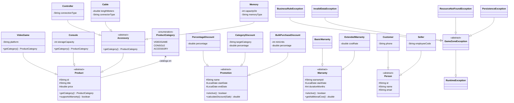

```mermaid
classDiagram
    direction BT
    
    %% ==========================================
    %% 1. JERARQUÍA DE PRODUCTOS (REFACTORIZADA)
    %% ==========================================
    class Product {
        <<abstract>>
        #String id
        #String title
        #double price
        +getCategory()* ProductCategory
        +supportsWarranty() boolean
    }
    class VideoGame {
        -String platform
        +getCategory() ProductCategory
    }
    class Console {
        -int storageCapacity
        +getCategory() ProductCategory
    }
    class Accessory {
        <<abstract>>
        +getCategory() ProductCategory
    }
    class Controller {
        -String connectionType
    }
    class Cable {
        -double lengthMeters
        -String connectorType
    }
    class Memory {
        -int capacityGb
        -String memoryType
    }
    class ProductCategory {
        <<enumeration>>
        VIDEOGAME
        CONSOLE
        ACCESSORY
    }

    Product <|-- VideoGame
    Product <|-- Console
    Product <|-- Accessory
    Accessory <|-- Controller
    Accessory <|-- Cable
    Accessory <|-- Memory
    Product --> ProductCategory : cataloga en

    %% ==========================================
    %% 2. JERARQUÍA DE PROMOCIONES
    %% ==========================================
    class Promotion {
        <<abstract>>
        #String name
        #LocalDate startDate
        #LocalDate endDate
        +isActive() boolean
        +calculateDiscount(Sale)* double
    }
    class PercentageDiscount {
        -double percentage
    }
    class CategoryDiscount {
        -String targetCategory
        -double percentage
    }
    class BulkPurchaseDiscount {
        -int minUnits
        -double percentage
    }

    Promotion <|-- PercentageDiscount
    Promotion <|-- CategoryDiscount
    Promotion <|-- BulkPurchaseDiscount

    %% ==========================================
    %% 3. JERARQUÍA DE GARANTÍAS
    %% ==========================================
    class Warranty {
        <<abstract>>
        #String warrantyId
        #LocalDate startDate
        #int durationMonths
        +isActive() boolean
        +getAdditionalCost()* double
    }
    class BasicWarranty {
    }
    class ExtendedWarranty {
        -double costRate
    }

    Warranty <|-- BasicWarranty
    Warranty <|-- ExtendedWarranty

    %% ==========================================
    %% 4. JERARQUÍA DE PERSONAS
    %% ==========================================
    class Person {
        <<abstract>>
        #String id
        #String name
        #String email
    }
    class Customer {
        -String phone
    }
    class Seller {
        -String employeeCode
    }

    Person <|-- Customer
    Person <|-- Seller

    %% ==========================================
    %% 5. JERARQUÍA DE EXCEPCIONES
    %% ==========================================
    class GameZoneException {
        <<abstract>>
    }
    class BusinessRuleException {
    }
    class InvalidDataException {
    }
    class ResourceNotFoundException {
    }
    class PersistenceException {
    }

    RuntimeException <|-- GameZoneException
    GameZoneException <|-- BusinessRuleException
    GameZoneException <|-- InvalidDataException
    GameZoneException <|-- ResourceNotFoundException
    GameZoneException <|-- PersistenceException
```