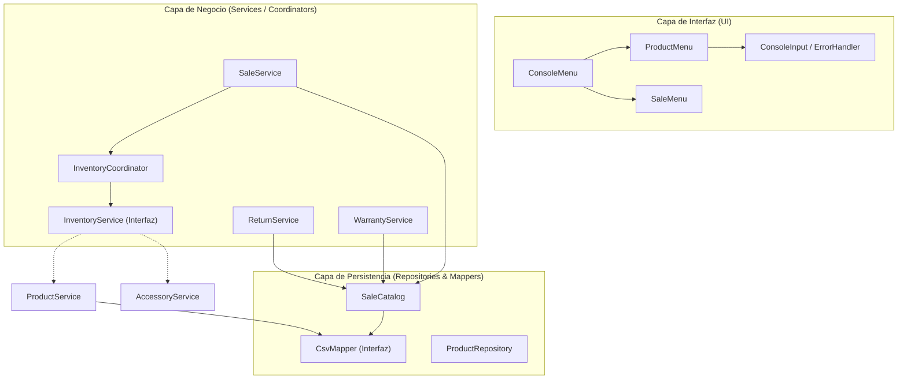

```mermaid
graph TD
    subgraph UI ["Capa de Interfaz (UI)"]
        ConsoleMenu["ConsoleMenu"]
        ProductMenu["ProductMenu"]
        SaleMenu["SaleMenu"]
        ConsoleInput["ConsoleInput / ErrorHandler"]
    end

    subgraph Service ["Capa de Negocio (Services / Coordinators)"]
        InventoryCoordinator["InventoryCoordinator"]
        InventoryService["InventoryService (Interfaz)"]
        SaleService["SaleService"]
        ReturnService["ReturnService"]
        WarrantyService["WarrantyService"]
    end

    subgraph Persistence ["Capa de Persistencia (Repositories & Mappers)"]
        SaleCatalog["SaleCatalog"]
        CsvMapper["CsvMapper (Interfaz)"]
        ProductRepository["ProductRepository"]
    end

    ConsoleMenu --> ProductMenu
    ConsoleMenu --> SaleMenu
    ProductMenu --> ConsoleInput
    
    SaleService --> InventoryCoordinator
    InventoryCoordinator --> InventoryService
    InventoryService -.-> ProductService
    InventoryService -.-> AccessoryService

    SaleService --> SaleCatalog
    ReturnService --> SaleCatalog
    WarrantyService --> SaleCatalog
    
    ProductService --> CsvMapper
    SaleCatalog --> CsvMapper
```