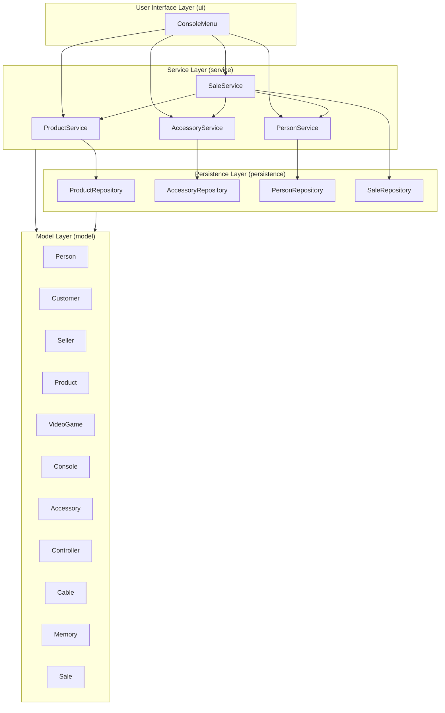

```mermaid
graph TD
    subgraph UI ["User Interface Layer (ui)"]
        ConsoleMenu
    end

    subgraph Service ["Service Layer (service)"]
        ProductService
        AccessoryService
        PersonService
        SaleService
    end

    subgraph Persistence ["Persistence Layer (persistence)"]
        ProductRepository
        AccessoryRepository
        PersonRepository
        SaleRepository
    end

    subgraph Model ["Model Layer (model)"]
        Person
        Customer
        Seller
        Product
        VideoGame
        Console
        Accessory
        Controller
        Cable
        Memory
        Sale
    end

    ConsoleMenu --> ProductService
    ConsoleMenu --> AccessoryService
    ConsoleMenu --> PersonService
    ConsoleMenu --> SaleService

    ProductService --> ProductRepository
    AccessoryService --> AccessoryRepository
    PersonService --> PersonRepository
    SaleService --> SaleRepository

    SaleService --> ProductService
    SaleService --> AccessoryService
    SaleService --> PersonService

    Service --> Model
    Persistence --> Model
```