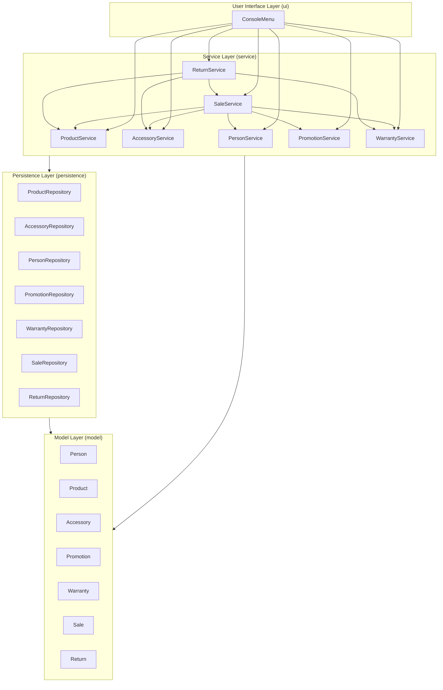

```mermaid
graph TD
    subgraph UI ["User Interface Layer (ui)"]
        ConsoleMenu
    end
    subgraph Service ["Service Layer (service)"]
        ProductService
        AccessoryService
        PersonService
        PromotionService
        WarrantyService
        SaleService
        ReturnService
    end
    subgraph Persistence ["Persistence Layer (persistence)"]
        ProductRepository
        AccessoryRepository
        PersonRepository
        PromotionRepository
        WarrantyRepository
        SaleRepository
        ReturnRepository
    end
    subgraph Model ["Model Layer (model)"]
        Person
        Product
        Accessory
        Promotion
        Warranty
        Sale
        Return
    end

    ConsoleMenu --> ProductService
    ConsoleMenu --> AccessoryService
    ConsoleMenu --> PersonService
    ConsoleMenu --> PromotionService
    ConsoleMenu --> WarrantyService
    ConsoleMenu --> SaleService
    ConsoleMenu --> ReturnService

    SaleService --> ProductService
    SaleService --> AccessoryService
    SaleService --> PersonService
    SaleService --> PromotionService
    SaleService --> WarrantyService
    ReturnService --> SaleService
    ReturnService --> ProductService
    ReturnService --> AccessoryService
    ReturnService --> WarrantyService

    Service --> Persistence
    Service --> Model
    Persistence --> Model
```