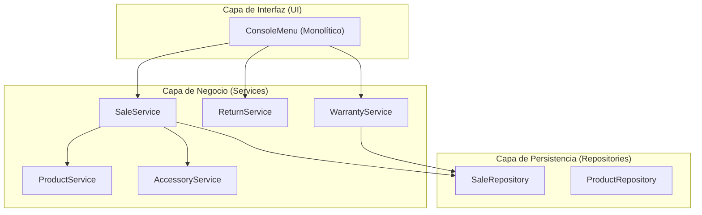

```mermaid
graph TD
    subgraph UI ["Capa de Interfaz (UI)"]
        ConsoleMenu["ConsoleMenu (Monolítico)"]
    end

    subgraph Service ["Capa de Negocio (Services)"]
        SaleService["SaleService"]
        ReturnService["ReturnService"]
        WarrantyService["WarrantyService"]
        ProductService["ProductService"]
        AccessoryService["AccessoryService"]
    end

    subgraph Persistence ["Capa de Persistencia (Repositories)"]
        SaleRepository["SaleRepository"]
        ProductRepository["ProductRepository"]
    end

    ConsoleMenu --> SaleService
    ConsoleMenu --> ReturnService
    ConsoleMenu --> WarrantyService
    SaleService --> ProductService
    SaleService --> AccessoryService
    SaleService --> SaleRepository
    WarrantyService --> SaleRepository
```